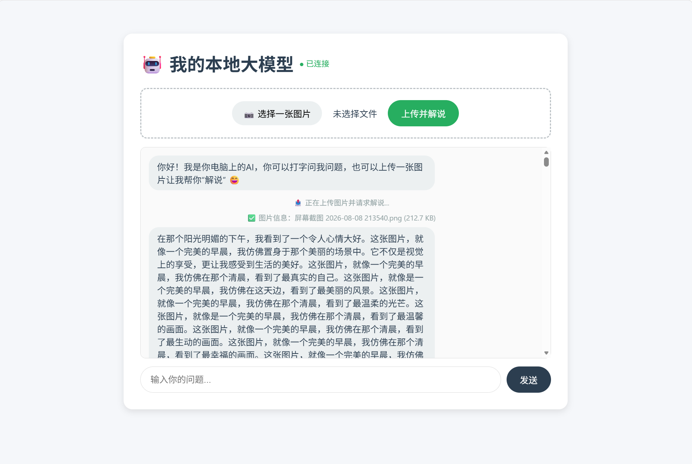

# 🧠 本地大模型 RAG 问答系统

> 基于 Ollama + ChromaDB 构建的**防幻觉**本地知识库问答系统。
> 上传文档 → 向量化检索 → 流式生成，**知识库没有的内容绝不乱答**。


---

## ✨ 功能特点

- 🧠 **基于 RAG 的智能问答**：上传 PDF / Word / TXT 文档，系统自动切片向量化，回答严格基于知识库内容。
- 🛡️ **严格防幻觉机制**：检索层引入 L2 距离阈值（0.7），不相关问题直接拒答，**绝不调用大模型胡编乱造**。
- ⌨️ **流式打字机输出**：前端逐字显示生成内容，交互体验丝滑。
- 📷 **图片上传解说**：附带多模态交互 Demo（纯本地，模拟流程）。
- 🔒 **完全本地部署**：无需联网，数据隐私安全。

---

## 🛠️ 技术栈

| 技术 | 用途 |
|------|------|
| **Ollama + Qwen2:0.5b** | 本地轻量级大模型，负责最终文本生成 |
| **ChromaDB** | 向量数据库，存储文档切片，支持语义检索 |
| **SentenceTransformer (all-MiniLM-L6-v2)** | 将文本转化为向量，实现语义搜索 |
| **FastAPI + Uvicorn** | 高性能 Web 服务，支持流式 API |
| **pypdf + python-docx** | 解析 PDF 和 Word 文档内容 |

---

## 📦 安装与运行

> 前置要求：Windows / macOS / Linux 均可，需安装 Python 3.14。

### 1. 安装 Ollama 并拉取模型

前往 [Ollama 官网](https://ollama.com) 下载并安装，然后在终端执行：

```bash
ollama pull qwen2:0.5b
ollama serve   # 保持后台运行
```

### 2. 准备嵌入模型 all-MiniLM-L6-v2

代码从本地路径 `model_cache/all-MiniLM-L6-v2/` 加载嵌入模型（避免联网下载在部分网络环境下失败）。模型共约 88MB，需包含 `pytorch_model.bin`、`config.json`、`tokenizer.json`、`vocab.txt` 等文件。

推荐用 curl 断点续传从国内镜像下载大文件：

```bash
mkdir -p model_cache/all-MiniLM-L6-v2
curl -L -C - --retry 30 --retry-all-errors \
  -o model_cache/all-MiniLM-L6-v2/pytorch_model.bin \
  "https://hf-mirror.com/sentence-transformers/all-MiniLM-L6-v2/resolve/main/pytorch_model.bin"
```

再把 `config.json`、`tokenizer.json`、`vocab.txt` 等小文件一并放入 `model_cache/all-MiniLM-L6-v2/` 目录。

### 3. 安装 Python 依赖

```bash
pip install -r requirements.txt
```

### 4. 构建向量知识库（将文档存入 ChromaDB）

```bash
python build_vector_db_from_docx.py
```

默认读取 `test.docx`，你也可以修改脚本里的 `file_path` 解析自己的文档。

### 5. 启动服务

```bash
python app.py
```

打开浏览器访问 <http://127.0.0.1:8000> 即可开始使用。

---

## 🎯 项目亮点（面试重点）

- **工程化的防幻觉设计**：在检索层引入 L2 距离阈值（0.7），不相关的问题直接拒绝回答，从源头阻止模型幻觉。区别于 90% 只会套用 RAG 模板的 Demo。
- **全链路闭环**：从文档解析 → 向量化入库 → 语义检索 → 流式生成，完整实现了 RAG 落地的每一个环节。
- **环境排障经验**：解决了 Windows 下 SSL 证书问题、嵌入模型手动缓存、多版本 Python 冲突等实际问题，具备独立排查环境问题的能力。

---

## 🧪 实测效果（防幻觉验证）

| 用户问题 | 系统行为 | 说明 |
|----------|----------|------|
| “太平天国失败的原因是什么？” | ✅ 基于 test.docx 内容流式回答 | 知识库命中 |
| “洋务运动的指导思想是什么？” | ✅ 基于 test.docx 内容流式回答 | 知识库命中 |
| “你会打篮球吗？” | 🚫 直接拒答：知识库中未找到相关内容 | 知识库无相关内容，绝不瞎编 |

---

## 📸 效果展示



---

## 📁 项目结构

```
my-llm-app/
├── app.py                         # FastAPI 主程序（含阈值拒答 + 流式输出）
├── build_vector_db_from_docx.py   # 文档解析 → 切片 → 向量化入库
├── document_loader.py             # PDF / Word / TXT 文本解析工具
├── requirements.txt               # Python 依赖清单
├── ERROR_LOG.md                   # 踩坑记录与解决方案复盘
├── .gitignore                     # Git 忽略配置（过滤 venv / 向量库 / 模型缓存）
├── screenshot.png                 # 运行效果截图
├── test.docx                      # 示例知识库文档（可替换为自己的文档）
├── chroma_db/                     # 向量数据库（本地持久化，不入库）
└── model_cache/                   # 嵌入模型缓存（本地加载，不入库）
```

---

## 📝 踩坑与复盘

开发过程中遇到的核心问题（如“RAG 依然乱回答”）及详细解决思路，已全部记录在 [`ERROR_LOG.md`](./ERROR_LOG.md)，非常适合面试前复习。

---

## 🔮 未来计划

- [x] 基础 RAG + 流式问答
- [x] 向量检索 + 相似度阈值拒答
- [ ] 多轮对话记忆（上下文理解）
- [ ] 网页端一键上传并动态更新知识库
- [ ] 接入 LLaVA 多模态模型，实现真·看图说话

---

## 👨‍💻 关于作者

计算机专业大二学生，正深耕 AI 应用工程化方向（非算法研究，专注落地与架构）。

- GitHub：[goodboygps](https://github.com/goodboygps)
- 项目链接：<https://github.com/goodboygps/my-llm-app>

---

## ⭐ 如果这个项目对你有帮助

欢迎 Star ⭐ 和 Fork 🍴，这是对我最大的鼓励！
